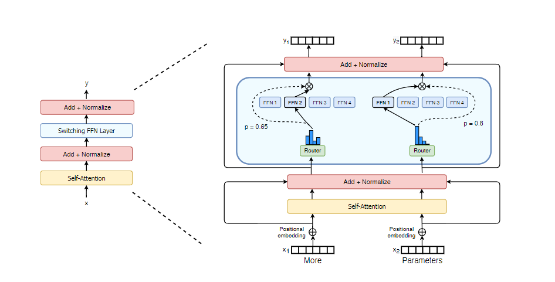

# README.md

# SwitchFormer: A Research Implementation of the Switch Transformer Architecture

**Author**: Esteban Carlin  
**Institution**: 國立臺灣科技大學: National Taiwan University of Science and Technology (NTUST)
**Supervisor**: 陳郁堂

---

## Project Overview

This project implements and extends the **Switch Transformer** architecture as described in the paper:
> *Fedus, Zoph, Shazeer. "Switch Transformers: Scaling to Trillion Parameter Models with Simple and Efficient Sparsity", JMLR 2022.*

[Original Paper (JMLR)](https://jmlr.org/papers/v23/21-0998.html)  

---

## Research Objectives

- Implement a working PyTorch-based Switch Transformer with configurable expert sparsity.
- Support routing mechanisms, expert load tracking, and auxiliary loss for balanced expert utilization.
- Train on a masked language modeling task using the [C4 dataset](https://www.tensorflow.org/datasets/catalog/c4) (subset).
- Log detailed routing metrics including:
  - Expert load histograms
  - Cumulative load balance
  - Drop ratio (for dropped tokens due to limited expert capacity)

---

## Repository Structure
```
SwitchTransformer/
├── config.yaml                                     # Experiment and model hyperparameters
├── environment.yml                                 # Conda environment configuration
├── find_max_batch_size.py                          # Utility to benchmark GPU memory limits
├── launch_training.md                              # Instructions to launch training
├── requirements.txt                                # Pinned dependencies
├── switch_train_eval.py                            # Main training and evaluation script
├── switch_transformer.py                           # Model architecture and MoE logic
├── test_cpu.py                                     # Lightweight CPU test run
├── SwitchFormer.pdf                                # Annotated paper reference
├── SwitchFormerArchitecture.png                    # Visual overview of Switch FFN design
```


---

## Key Features

- **Switch FFN Layer**: Replaces standard dense FFN with a single-expert router (`k=1`), improving speed and simplicity.
- **Auxiliary Load Loss**: Promotes even token distribution across experts using dot product between token counts and router probabilities.
- **Drop Ratio Logging**: Tracks tokens dropped due to expert overload.
- **Mixed Precision & Checkpointing**: Supports AMP and gradient checkpointing for efficient multi-GPU training.
- **Span Masking**: T5-style input corruption strategy for MLM tasks.
- **Scalable Design**: Tested up to 128 experts with configurable `capacity_factor` and expert frequency.

---
## Architecture Diagram

Below is a visual representation of the implemented Switch FFN layer with routing, from the original paper:



---

## Notes

- Visuals and routing mechanics are based on the diagram (`SwitchFormerArchitecture.png`) that follows the original figure in the paper.
- Includes CPU fallback script (`test_cpu.py`) to validate functionality outside GPU clusters.
- Poster and report documenting results are included separately (see deliverables).

---

## Citation

If using this repository or extending it in your own research, please cite:
```
@article{fedus2022switch,
title={Switch Transformers: Scaling to Trillion Parameter Models with Simple and Efficient Sparsity},
author={Fedus, William and Zoph, Barret and Shazeer, Noam},
journal={Journal of Machine Learning Research},
volume={23},
pages={1--40},
year={2022}
}
```

---

## Requirements

Install dependencies using either:

```bash
conda env create -f environment.yml
conda activate switchformer
```
or
```bash
pip install -r requirements.txt
```

Getting Started
```bash
python switch_train_eval.py --config config.yaml
```

Contact
For any questions or feedback, please contact esteban.carlin@centrale-marseille.fr